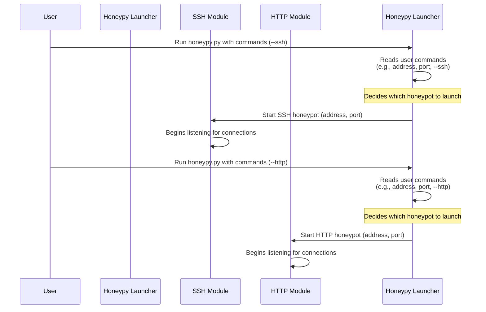

# Chapter 1: Honeypot Launcher/Orchestrator

Welcome to the exciting world of HoneyPy! In this first chapter, we're going to uncover the "brain" of our project: the **Honeypot Launcher/Orchestrator**. Don't worry if those words sound a bit technical; we'll break it down into simple, easy-to-understand pieces.

### What's the Big Idea? Your Honeypot's Remote Control!

Imagine you want to set up a digital trap (a "honeypot") to catch bad guys trying to break into your systems. Maybe you want to pretend to have a secure SSH server, or perhaps a fake website login page. How do you tell HoneyPy what kind of trap to set and where to put it?

That's exactly what the Honeypot Launcher/Orchestrator does! Think of it like the ultimate **remote control** for your HoneyPy system. When you use HoneyPy, this component is the first thing that springs to life. It listens to your commands and then makes sure the right type of honeypot starts running, ready to collect information from curious (and often malicious) visitors.

### How Do You Use It? Giving HoneyPy Instructions

Using the Honeypot Launcher/Orchestrator is actually very simple. You interact with it directly through the main `honeypy.py` file, which is the heart of the HoneyPy project.

Let's say you want to launch an SSH honeypot. SSH is a common way for people to connect securely to remote computers. A fake SSH server can trick attackers into thinking they've found a real system.

Here's how you'd tell HoneyPy to start an SSH honeypot:

```bash
python3 honeypy.py -a 0.0.0.0 -p 22 --ssh
```

Let's break down that command:

*   `python3 honeypy.py`: This is how you tell your computer to run the main HoneyPy program.
*   `-a 0.0.0.0` (or `--address 0.0.0.0`): This tells HoneyPy *where* to listen for connections. `0.0.0.0` is a special address that means "listen on all available network interfaces." It's like saying, "Keep an ear out for anyone trying to connect to this computer from anywhere."
*   `-p 22` (or `--port 22`): This tells HoneyPy *which door* to listen on. Port 22 is the standard port for SSH connections. Attackers often scan for port 22 to find potential SSH servers.
*   `--ssh`: This is the crucial instruction for the Launcher/Orchestrator! It explicitly tells HoneyPy: "I want to start an **SSH honeypot**."

What happens after you run this command? HoneyPy will print a message:

```
[-] Running SSH Honeypot...
```

And just like that, your SSH honeypot is active and waiting!

You can also start a different kind of trap, an HTTP honeypot (which pretends to be a website). For instance, to simulate a WordPress login page on port 8080:

```bash
python3 honeypy.py -a 0.0.0.0 -p 8080 --http
```

Here, `--http` tells the Launcher/Orchestrator to start the web-based honeypot instead of SSH.

### Under the Hood: How the Launcher/Orchestrator Works

So, what exactly happens when you type that command and press Enter? Let's use an analogy. Imagine you have a special assistant (the Honeypot Launcher) and a collection of specialized tools (the different honeypot modules).

1.  **You (User)**: You tell your assistant: "Hey, run the main HoneyPy program, listen everywhere on port 22, and start the SSH tool!"
2.  **`honeypy.py` (The Assistant)**: The assistant hears your command. It first grabs all the details you provided (address, port, honeypot type).
3.  **Decision Time**: The assistant looks at your "start the SSH tool" instruction.
4.  **Dispatch**: Based on that instruction, it picks out the correct specialized tool – in this case, the [SSH Honeypot Module](02_ssh_honeypot_module_.md) – and tells it to get to work using the address and port you specified.

Here’s a simplified diagram of this process:



#### A Peek at the Code

Let's look at a super simplified version of the `honeypy.py` code to see this "decision-making" in action. Don't worry about every detail; just focus on how it reads your instructions and then acts on them.

```python
# From honeypy.py (simplified)
import argparse

# This part sets up how HoneyPy understands your commands
parser = argparse.ArgumentParser()
parser.add_argument('-a','--address', type=str, required=True) # For the address
parser.add_argument('-p','--port', type=int, required=True)     # For the port
parser.add_argument('-s', '--ssh', action="store_true")         # If you type --ssh
parser.add_argument('-wh', '--http', action="store_true")       # If you type --http

args = parser.parse_args() # HoneyPy reads all your commands here!

# Now, based on what you told it...
if args.ssh:
    print("[-] Running SSH Honeypot...")
    # This line tells the SSH Module to start!
    from ssh_honeypot import honeypot
    honeypot(args.address, args.port, None, None, False)

elif args.http:
    print('[-] Running HTTP Wordpress Honeypot...')
    # This line tells the HTTP Module to start!
    from web_honeypot import run_app
    run_app(args.port, "admin", "deeboodah")

else:
    print("[!] You can only choose SSH (-s) or HTTP (-wh)!")
```

In this code snippet:

1.  `argparse`: This Python tool helps `honeypy.py` understand the arguments you type after `python3 honeypy.py` (like `-a`, `-p`, `--ssh`).
2.  `args.ssh` and `args.http`: These are like switches that are turned `True` if you include `--ssh` or `--http` in your command.
3.  `if args.ssh:`: If you used `--ssh`, this block of code runs. It imports the specific SSH honeypot code from `ssh_honeypot.py` and then calls its `honeypot()` function, passing along the address and port you provided. This `honeypot()` function is the actual [SSH Honeypot Module](02_ssh_honeypot_module_.md) starting up.
4.  `elif args.http:`: If you used `--http` instead, this block runs, starting the [HTTP Honeypot Module](03_http_honeypot_module_.md) similarly.

The Honeypot Launcher/Orchestrator acts as a traffic controller, making sure the right honeypot module gets your instructions and starts working as intended.

### Conclusion

You've just learned about the brain of HoneyPy: the Honeypot Launcher/Orchestrator! It's the central command center that takes your instructions (like "start an SSH honeypot on port 22") and dispatches the correct specialized honeypot to begin its operation. This makes HoneyPy flexible and easy to use, allowing you to choose and deploy different types of digital traps with simple commands.

Now that you understand how to tell HoneyPy *what* kind of honeypot to run, let's dive into one of those specific traps: the SSH Honeypot.

[Next Chapter: SSH Honeypot Module](02_ssh_honeypot_module_.md)

---