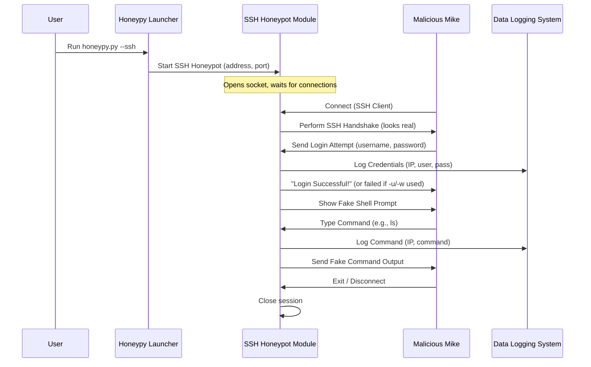

# Chapter 2: SSH Honeypot Module

Welcome back to HoneyPy! In [Chapter 1: Honeypot Launcher/Orchestrator](01_honeypot_launcher_orchestrator_.md), you learned how to be the "remote control" for HoneyPy, telling it *what kind* of digital trap to set. Now, we're going to open up one of those traps and see how it works: the **SSH Honeypot Module**.

### What's the Big Idea? A Fake Remote Computer!

Have you ever heard of SSH? It stands for "Secure Shell," and it's a very common way for people to securely connect to and control computers remotely. It's like having a special, encrypted window into another machine, where you can type commands as if you were sitting right in front of it.

Bad guys often try to find SSH servers because if they can log in, they might be able to take over that computer.

The **SSH Honeypot Module** in HoneyPy is designed to be a clever trick. It pretends to be a real, live SSH server – a convincing fake remote computer! But instead of being a real system that could be damaged, it's a digital fishing lure.

**Its main job is to:**

1.  **Look Real**: Attract attackers by appearing to be a legitimate Linux machine.
2.  **Lure Logins**: Encourage attackers to try and log in with usernames and passwords.
3.  **Capture Data**: Record every single detail: the attacker's IP address, the usernames and passwords they try, and even the commands they type into the fake shell.
4.  **Waste Their Time**: Optionally slow down persistent attackers with a "tarpit" feature.

### How Do You Use It? Setting the Trap!

You already know the basic command from Chapter 1. To start an SSH honeypot that listens for connections on all network interfaces (your computer's IP addresses) on the standard SSH port 22:

```bash
python3 honeypy.py -a 0.0.0.0 -p 22 --ssh
```

**Important Note**: Running on port 22 usually requires `sudo` (admin) privileges on Linux, and you must ensure no *real* SSH server is already running on that port. For testing without `sudo`, you can use a higher port, like 2223:

```bash
python3 honeypy.py -a 0.0.0.0 -p 2223 --ssh
```

Once you run this, HoneyPy will print:

```
SSH server is listening on port 2223.
```

Now, the trap is set!

### Interacting with Your SSH Honeypot (As an "Attacker")

Let's pretend you're an attacker (for educational purposes, of course!). You've found a server listening on port 2223 and you want to try to log in via SSH.

Open *another* terminal window and use the `ssh` command:

```bash
ssh -p 2223 127.0.0.1
```

*   `ssh`: The command to connect via SSH.
*   `-p 2223`: Specifies the port (we're using 2223 for our example).
*   `127.0.0.1`: This is "localhost," meaning your own computer.

You'll be asked for a password. You can type *anything* for the username and password (unless you specify otherwise, as we'll see next). HoneyPy will accept it and then present you with a fake shell prompt, usually something like `corporate-jumpbox2$`.

Now, try typing some basic Linux commands:

```
corporate-jumpbox2$ ls
jumpbox1.conf
corporate-jumpbox2$ pwd
\usr\local
corporate-jumpbox2$ whoami
corpuser1
corporate-jumpbox2$ cat jumpbox1.conf
Go to deeboodah.com
corporate-jumpbox2$ whatisthis
whatisthis
corporate-jumpbox2$ exit
Goodbye!
```

As you can see, the honeypot responds to a few common commands with pre-programmed answers. For commands it doesn't "know" (like `whatisthis`), it often just echoes them back, pretending to execute them. All of this interaction is being secretly logged by HoneyPy!

### Making Your SSH Honeypot More Specific

You can also make the honeypot require a specific username and password, and even enable the "tarpit" feature:

```bash
python3 honeypy.py -a 0.0.0.0 -p 2223 --ssh -u admin -w MySecretPass --tarpit
```

Let's break down the new parts:

*   `-u admin` (or `--username admin`): This tells the SSH honeypot that only "admin" will be accepted as a username.
*   `-w MySecretPass` (or `--password MySecretPass`): This makes "MySecretPass" the only accepted password for the "admin" user. Any other combo will appear to fail (though still be logged!).
*   `--tarpit`: This activates the "tarpit" feature, which will significantly slow down the attacker after they connect.

### Under the Hood: How the SSH Honeypot Works Its Magic

So, how does HoneyPy create this convincing fake SSH server?

#### A Step-by-Step Walkthrough

Imagine an attacker (let's call them "Malicious Mike") tries to connect to your SSH honeypot:

1.  **You Start HoneyPy**: You run `python3 honeypy.py -a 0.0.0.0 -p 2223 --ssh`.
2.  **[Honeypot Launcher/Orchestrator](01_honeypot_launcher_orchestrator_.md) Takes Over**: The Launcher sees `--ssh` and tells the **SSH Honeypot Module** to start up, listening on port 2223.
3.  **Honeypot Waits**: The SSH module opens a network door (socket) on port 2223 and patiently waits.
4.  **Mike Connects**: Malicious Mike uses his SSH client and connects to your honeypot.
5.  **SSH Handshake (Pretense)**: The SSH Honeypot Module uses a special Python library called `paramiko` to pretend to be a real SSH server. It performs the initial "handshake" – exchanging keys and setting up encrypted communication – just like a real server would. It even sends a fake SSH banner (like `SSH-2.0-MySSHServer_1.0`).
6.  **Mike Tries to Log In**: Mike enters a username and password.
7.  **Credentials Logged**: *Before* even checking the password, the honeypot instantly records Mike's IP, username, and password attempt using the [Data Logging System](04_data_logging_system_.md).
8.  **Login Outcome**: If you set specific credentials (`-u`, `-w`), the honeypot checks if Mike's input matches. If not, or if no specific credentials were set, it still *pretends* the login was successful so Mike feels like he's "in."
9.  **Fake Shell Presentation**: The honeypot presents Mike with a fake command prompt (e.g., `corporate-jumpbox2$`).
10. **Mike Types Commands**: Mike starts typing commands like `ls`, `pwd`, or even malicious commands.
11. **Commands Logged & Answered**: For every command Mike types, the honeypot records it, then gives a pre-programmed, fake response.
12. **Mike Disconnects**: Eventually, Mike leaves. The honeypot cleans up the session and continues waiting for the next connection.

Here's a simplified flow diagram:



#### A Peek at the Code

Let's look at some super simplified pieces from `ssh_honeypot.py` to see how this works.

First, the main `honeypot` function is like the gatekeeper. It opens the port and, for every new connection, it creates a new "helper" (a thread) to handle that specific client, so it can keep listening for more connections without getting bogged down.

```python
# Simplified from ssh_honeypot.py
import socket
import threading

def honeypot(address, port, username, password, tarpit=False):
    # 1. Open a "door" (socket) on the specified address and port.
    socks = socket.socket(socket.AF_INET, socket.SOCK_STREAM)
    socks.setsockopt(socket.SOL_SOCKET, socket.SO_REUSEADDR, 1)
    socks.bind((address, port))
    socks.listen(100) # Can handle up to 100 waiting connections

    print(f"SSH honeypot listening on {address}:{port}")

    while True:
        # 2. When someone knocks, accept their connection.
        client, addr = socks.accept()
        # 3. Start a new "helper" (thread) to talk to them,
        #    so the main honeypot can keep listening for others.
        thread = threading.Thread(target=client_handle, args=(client, addr, username, password, tarpit))
        thread.start()
```

Next, the `client_handle` function is where the honeypot puts on its SSH disguise. It uses the `paramiko` library to create a fake SSH server instance and start communicating.

```python
# Simplified from ssh_honeypot.py (focus on Paramiko setup)
import paramiko
# ... other imports and definitions like host_key ...

def client_handle(client, addr, username, password, tarpit=False):
    client_ip = addr[0]
    # 1. Initialize a Paramiko Transport object for SSH communication.
    transport = paramiko.Transport(client)
    # 2. Set a fake banner to look like a real SSH server.
    transport.local_version = "SSH-2.0-MySSHServer_1.0"

    # 3. Create a custom "Server" object to handle SSH specifics (like logins).
    server = Server(client_ip=client_ip, input_username=username, input_password=password)
    # 4. Add the server's host key (from static/server.key) for authenticity.
    transport.add_server_key(host_key)
    # 5. Start the fake SSH server protocol.
    transport.start_server(server=server)

    # 6. Wait for the client to request a channel (like a session).
    channel = transport.accept(100)
    if channel:
        # If tarpit is enabled, send a very long, slow banner.
        if tarpit:
            # ... tarpit logic (sending characters with delay) ...
            pass
        else:
            channel.send(b"Welcome to Ubuntu 22.04 LTS (Jammy Jellyfish)!\r\n\r\n")

        # 7. Hand over control to the emulated shell.
        emulated_shell(channel, client_ip=client_ip)
    # ... finally, close the connection ...
```

The `Server` class is a crucial part of `paramiko` that lets us customize how the SSH server behaves, especially when it comes to authentication:

```python
# Simplified from ssh_honeypot.py (focus on authentication)
class Server(paramiko.ServerInterface):
    def __init__(self, client_ip, input_username=None, input_password=None):
        self.client_ip = client_ip
        self.input_username = input_username
        self.input_password = input_password

    # This method is called by Paramiko when a client tries to authenticate with a password.
    def check_auth_password(self, username, password):
        # **This is where the logging happens!**
        # The honeypot first records the attempted credentials.
        # It sends this info to the Data Logging System (creds_logger and funnel_logger).
        # creds_logger.info(f'{self.client_ip}, {username}, {password}')

        if self.input_username is not None and self.input_password is not None:
            # If you specified a username/password, check against those.
            if username == self.input_username and password == self.input_password:
                return paramiko.AUTH_SUCCESSFUL # Login "successful"
            else:
                return paramiko.AUTH_FAILED # Login "failed"
        else:
            # If no specific username/password was set, accept ANYTHING!
            # This captures more data from attackers who might try random credentials.
            return paramiko.AUTH_SUCCESSFUL
```

Finally, the `emulated_shell` function is what makes the honeypot respond to commands, making the attacker believe they are in a real terminal:

```python
# Simplified from ssh_honeypot.py (focus on shell emulation)
def emulated_shell(channel, client_ip):
    channel.send(b"corporate-jumpbox2$ ") # Send a fake command prompt.
    command = b""
    while True:
        char = channel.recv(1) # Read input character by character.
        # ... (code to handle backspace and echo characters back to the user) ...

        if char == b"\r": # If the attacker presses Enter.
            # **This is where command logging happens!**
            # The honeypot logs the command to the Data Logging System (funnel_logger).
            # funnel_logger.info(f'Command {command.strip()}' + "executed by " f'{client_ip}')

            if command.strip() == b'exit':
                channel.send(b"\n Goodbye!\n")
                channel.close()
                break # End the session.
            elif command.strip() == b'pwd':
                response = b"\n\\usr\\local\r\n" # Send a fake path.
            elif command.strip() == b'ls':
                response = b"\njumpbox1.conf\r\n" # Send a fake file list.
            # ... more "known" commands like 'whoami', 'cat jumpbox1.conf' ...
            else:
                # For unknown commands, just echo them back, pretending to execute.
                response = b"\n" + bytes(command.strip()) + b"\r\n"

            channel.send(response) # Send the fake response.
            channel.send(b"corporate-jumpbox2$ ") # Show the prompt again.
            command = b"" # Reset for the next command.
```

#### The "Tarpit" Feature

The `--tarpit` option is a clever trick designed to frustrate and slow down attackers. It works by sending a *very long* SSH welcome banner, but with significant delays between each character.

```python
# Simplified from ssh_honeypot.py (tarpit logic within client_handle)
# ... inside the client_handle function, after channel is accepted ...

        try:
            if tarpit:
                standard_banner = "Welcome to Ubuntu 22.04 LTS (Jammy Jellyfish)!\r\n\r\n"
                endless_banner = standard_banner * 100 # Repeat the banner many times!
                for char in endless_banner:
                    channel.send(char.encode('utf-8')) # Send one character at a time.
                    time.sleep(8) # **WAIT 8 SECONDS BEFORE THE NEXT CHARACTER!**
            else:
                channel.send(b"Welcome to Ubuntu 22.04 LTS (Jammy Jellyfish)!\r\n\r\n")
            # ... then proceed to emulated_shell ...
```

Imagine waiting 8 seconds for *each* letter of a long message. An attacker's SSH client will just hang, waiting for the full banner. Most attackers will quickly realize something is wrong and disconnect, wasting their time and exposing their IP in the process.

### Conclusion

The **SSH Honeypot Module** is a powerful tool for attracting, observing, and logging malicious activity targeting SSH services. It meticulously mimics a real SSH server, capturing valuable intelligence like usernames, passwords, and commands, all without risking a real system. Its `paramiko`-powered backend handles the complexities of the SSH protocol, while the emulated shell provides a believable environment for attackers to interact with.

Now that you understand how HoneyPy creates a fake SSH server, let's explore another common trap: a fake website!

[Next Chapter: HTTP Honeypot Module](03_http_honeypot_module_.md)

---
