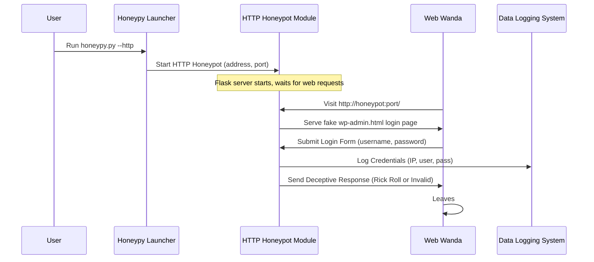

# Chapter 3: HTTP Honeypot Module

Welcome back, digital detective! In [Chapter 1: Honeypot Launcher/Orchestrator](01_honeypot_launcher_orchestrator_.md), you learned how to tell HoneyPy what kind of trap to set. Then, in [Chapter 2: SSH Honeypot Module](02_ssh_honeypot_module_.md), we explored a fake remote computer (SSH). Now, let's dive into another clever trap: the **HTTP Honeypot Module**, which pretends to be a fake website!

### What's the Big Idea? A Fake Website Login Page!

Imagine attackers are scanning the internet, looking for vulnerable websites they can break into. Many look for popular platforms like WordPress, hoping to find an unprotected login page. If they can guess a username and password, they might gain control of the site.

The **HTTP Honeypot Module** takes advantage of this. It's like setting up a very convincing, but fake, storefront. Instead of a real shop, it's a website designed to look exactly like a common WordPress administration login page (`wp-admin`).

**Its main purpose is to:**

1.  **Lure Attackers**: Attract anyone trying to find and exploit vulnerable websites.
2.  **Mimic WordPress**: Present a realistic-looking WordPress login page to trick them.
3.  **Capture Credentials**: When someone tries to log in, it secretly captures their entered username and password.
4.  **Log for Analysis**: All collected data (IP address, username, password) is logged for you to analyze later.
5.  **Give a Deceptive Response**: Instead of actually logging them in (which would be impossible on a fake site), it either gives a "Rick Roll" message (a classic internet prank) or an "invalid credentials" message.

This module is a smart way to catch "credential stuffing" attempts, where attackers try lists of stolen usernames and passwords against many websites, hoping some will work.

### How Do You Use It? Setting the Web Trap!

You use the same main `honeypy.py` file to launch the HTTP honeypot, just like you did with SSH.

To start an HTTP honeypot that mimics a WordPress login page, listening on all network interfaces (your computer's IP addresses) on a specific port, say `8080`:

```bash
python3 honeypy.py -a 0.0.0.0 -p 8080 --http
```

Let's break down this command:

*   `python3 honeypy.py`: Tells your computer to run the HoneyPy program.
*   `-a 0.0.0.0` (or `--address 0.0.0.0`): HoneyPy will listen for connections from any IP address on your network.
*   `-p 8080` (or `--port 8080`): This is the "door" number the fake website will use. Web servers usually run on port 80 (HTTP) or 443 (HTTPS), but 8080 is a common alternative, especially for testing, and doesn't usually require special administrator permissions.
*   `--http`: This is the key instruction for the [Honeypot Launcher/Orchestrator](01_honeypot_launcher_orchestrator_.md)! It tells HoneyPy: "Start the **HTTP honeypot**."

Once you run this command, HoneyPy will print a message:

```
[-] Running HTTP Wordpress Honeypot...
 * Debug mode: on
... (more Flask-related messages) ...
 * Running on http://127.0.0.1:8080/ (Press CTRL+C to quit)
```

Now, your fake WordPress login page is active and waiting!

### Interacting with Your HTTP Honeypot (As an "Attacker")

To see the honeypot in action, open your web browser (like Chrome, Firefox, or Edge) and type the address into the address bar:

`http://111.222.333.444:8080` (Replace `111.222.333.444` with your computer's actual IP address, or `127.0.0.1` if you're testing on the same machine).

You'll see a page that looks exactly like a WordPress `wp-admin` login. Go ahead and try to "log in" with any username and password, for example:

*   **Username:** `attacker`
*   **Password:** `password123`

Click "Login."

What happens? You'll either get a message like "Invalid username or password, please try again." Or, if you use the special default credentials (`admin` / `deeboodah`), you'll get a link to a "Rick Roll" video! Either way, you'll never actually gain access, but your login attempt will be secretly recorded.

### Making Your HTTP Honeypot More Specific

You can also set specific credentials for the fake login, similar to the SSH honeypot:

```bash
python3 honeypy.py -a 0.0.0.0 -p 8080 --http -u myadmin -w MyTopSecretPass
```

Here:

*   `-u myadmin` (or `--username myadmin`): Only "myadmin" will trigger the "Rick Roll" response.
*   `-w MyTopSecretPass` (or `--password MyTopSecretPass`): This makes "MyTopSecretPass" the corresponding password.

Any other username/password combination will result in the "Invalid username or password" message, but *all* attempts are logged!

### Under the Hood: How the HTTP Honeypot Works Its Magic

So, how does HoneyPy create this fake website? It uses a popular Python tool called **Flask**, which is a "web framework." Think of Flask as a toolkit that helps you quickly build simple websites or web services.

#### A Step-by-Step Walkthrough

Let's imagine an attacker (let's call her "Web Wanda") tries to access your HTTP honeypot:

1.  **You Start HoneyPy**: You run `python3 honeypy.py -a 0.0.0.0 -p 8080 --http`.
2.  **[Honeypot Launcher/Orchestrator](01_honeypot_launcher_orchestrator_.md) Takes Over**: The Launcher sees `--http` and tells the **HTTP Honeypot Module** to start up, listening on port 8080.
3.  **Flask Server Starts**: The HTTP module uses Flask to start a mini web server on port 8080.
4.  **Wanda Connects**: Web Wanda opens her browser and navigates to your honeypot's IP address and port (e.g., `http://your-ip:8080`).
5.  **Fake Login Page Served**: The honeypot's Flask server responds by sending Wanda the `wp-admin.html` page, which looks like a WordPress login.
6.  **Wanda Enters Credentials**: Wanda types a username and password into the fake login form and clicks "Login." Her browser then sends this information to the honeypot.
7.  **Credentials Logged**: *Before* giving any response, the honeypot immediately captures Wanda's IP address, the username, and the password she entered. This information is sent to the [Data Logging System](04_data_logging_system_.md).
8.  **Deceptive Response**: The honeypot checks if Wanda's entered credentials match any special set ones (like `admin`/`deeboodah` or ones you set with `-u`/`-w`).
    *   If they match, it sends back the "Rick Roll" URL.
    *   If they don't match, it sends back the "Invalid username or password" message.
    *   Crucially, no actual login ever happens.
9.  **Wanda Leaves**: Wanda either gets Rick Rolled or an error message and eventually moves on. The honeypot continues waiting for the next visitor.

Here's a simplified flow diagram:



#### A Peek at the Code

Let's look at some super simplified pieces from `web_honeypot.py` to see how this works.

First, the `run_app` function is the main entry point for the HTTP honeypot. It sets up the Flask application and tells it to start running.

```python
# Simplified from web_honeypot.py
from flask import Flask # This is the web framework!
# ... other imports for logging, etc. ...

def run_app(port=5000, input_username="admin", input_password="deeboodah"):
     # Create the Flask application (our fake website).
     app = Flask(__name__) # __name__ helps Flask find files.

     # This part (baseline_web_honeypot) configures the website's pages.
     # We'll see it next!
     # app = baseline_web_honeypot(input_username, input_password)

     # Start the web server! It listens on the specified port and address.
     # Note: The original code explicitly sets host="127.0.0.1",
     # but HoneyPy's launcher intends to use the address you provide with -a.
     app.run(debug=True, port=port, host="0.0.0.0") # Use 0.0.0.0 for external access
```
*(Note: The actual `web_honeypot.py` uses a helper function `baseline_web_honeypot` to set up the routes, but for simplicity, we'll combine the essence here.)*

Inside the Flask application, we define different "routes" which are like different pages or actions on our website.

```python
# Simplified from web_honeypot.py (inside the Flask app setup)
# ... app = Flask(__name__) ...

@app.route('/') # This means: "When someone visits the main page (e.g., http://your-ip:8080/)"
def index():
    # Send them the 'wp-admin.html' file, which is our fake login page.
    return render_template('wp-admin.html')

@app.route('/wp-admin-login', methods=['POST']) # "When someone submits the login form"
def login():
    # Get the username and password they entered from the form.
    username = request.form['username']
    password = request.form['password']

    # Get the attacker's IP address.
    ip_address = request.remote_addr

    # **This is where the logging happens!**
    # The honeypot records the attempted credentials to a special log file.
    # funnel_logger.info(f'Client with IP: {ip_address} entered\n Username: {username}, Password: {password}')

    # Check if the credentials match specific ones.
    if username == "admin" and password == "deeboodah": # Or your custom -u/-w
        # Give them the Rick Roll link!
        return 'Please go to https://r.mtdv.me/gYVb1JYxGw'
    else:
        # Otherwise, tell them it's invalid.
        return "Invalid username or password, please try again."
```

In this code:

1.  `app = Flask(__name__)`: This creates our web application.
2.  `@app.route('/')`: This is a decorator that tells Flask what to do when a user visits the main URL (e.g., `http://your-ip:8080/`). It then uses `render_template('wp-admin.html')` to show the fake WordPress login page.
3.  `@app.route('/wp-admin-login', methods=['POST'])`: This tells Flask to handle requests to the `/wp-admin-login` URL, specifically when a login form is *submitted* (which uses the `POST` method).
4.  `request.form['username']` and `request.form['password']`: These lines grab the information the user typed into the "username" and "password" boxes on the web page.
5.  `request.remote_addr`: This gets the IP address of the person trying to log in.
6.  `funnel_logger.info(...)`: This is the crucial part that sends all the collected data (IP, username, password) to the [Data Logging System](04_data_logging_system_.md).
7.  The `if/else` block then decides whether to show the "Rick Roll" or "Invalid credentials" message based on the input, never actually granting access.

The `wp-admin.html` file (located in the `templates` folder) is a simple HTML file with some CSS (styling) to make it look like a real WordPress login page. HoneyPy doesn't need a real WordPress installation; it just needs this one HTML file to trick attackers.

### Conclusion

The **HTTP Honeypot Module** is an excellent way to simulate a vulnerable web application, specifically a WordPress login page, without exposing any real systems to risk. It effectively lures attackers looking for easy targets, captures valuable intelligence like their IP addresses and credential attempts, and wastes their time with a deceptive response. Using the Flask web framework, HoneyPy makes it easy to set up these convincing web-based traps.

Now that we've seen how both SSH and HTTP honeypots capture data, let's explore how all that precious information is actually stored and managed.

[Next Chapter: Data Logging System](04_data_logging_system_.md)

---