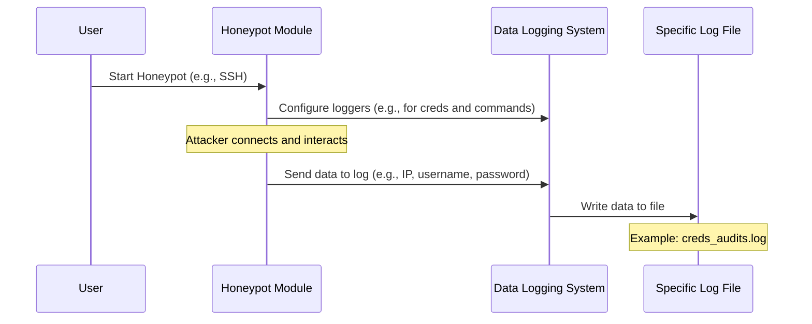

# Chapter 4: Data Logging System

Welcome back, digital detective! In [Chapter 2: SSH Honeypot Module](02_ssh_honeypot_module_.md) and [Chapter 3: HTTP Honeypot Module](03_http_honeypot_module_.md), you learned how HoneyPy sets up fake SSH servers and websites to trick attackers. These honeypots are busy capturing valuable information – like the usernames and passwords attackers try, or the commands they type. But where does all this precious evidence go?

Imagine a security camera at a bank. It records everything that happens. But what good is a camera if there's no recorder to save the footage?

That's exactly what the **Data Logging System** does for HoneyPy! It's HoneyPy's "black box recorder," diligently writing down every interaction an attacker has with your honeypots. All this captured "footage" is crucial for understanding attack patterns and gathering forensic evidence.

### What's the Big Idea? HoneyPy's Black Box Recorder!

The Data Logging System is the silent, vigilant guardian that ensures no piece of attacker activity goes unnoticed or unrecorded. Every time an attacker tries to log in, types a command, or interacts with a fake web page, this system springs into action.

**Its main purpose is to:**

1.  **Capture Everything**: Record every single detail of an attacker's interaction with any honeypot module.
2.  **Organize Evidence**: Store this information neatly into specific log files.
3.  **Preserve for Analysis**: Keep these logs safe so you can analyze them later.

HoneyPy categorizes these logs to make your life easier when you're sifting through the evidence. Think of it like a filing cabinet with clearly labeled folders:

*   `creds_audits.log`: This file specifically stores all the **usernames and passwords** attackers try on the SSH honeypot.
*   `cmd_audits.log`: This file records every **command** an attacker types into the fake SSH shell.
*   `http_audit.log`: This file captures details about **web interactions**, including username and password attempts, from the HTTP honeypot.

This organized logging ensures that all forensic evidence is captured and preserved for later analysis, much like a security camera recording activity.

### How Does it Work? Automatic Logging!

The best part about the Data Logging System is that you don't need to do anything special to "use" it. It works automatically in the background whenever a honeypot is active! When you launched your SSH or HTTP honeypot in earlier chapters, this logging system was already busy at work.

The "use case" for you is knowing *where* to find these logs and how to inspect them.

All log files are stored in the `log_files` directory within your HoneyPy project.

Let's see what these logs look like after some attacker interactions.

#### Example: SSH Credential Attempts

If an attacker tried to log into your SSH honeypot with a few different username/password combinations, your `creds_audits.log` file might look something like this:

```
# From log_files/creds_audits.log
127.0.0.1, eshwarsai, pass
127.0.0.1, eshwarsai, 462005
127.0.0.1, admin, 12345
192.168.1.10, root, password
```

Each line shows the attacker's IP address, the username they tried, and the password they used, separated by commas.

#### Example: SSH Commands

If an attacker successfully connected (even to the fake SSH shell) and started typing commands, your `cmd_audits.log` would capture that:

```
# From log_files/cmd_audits.log
Client 127.0.0.1 attempted connection with username: eshwarsai, password: 462005
Command b'ls'executed by 127.0.0.1
Command b'pwd'executed by 127.0.0.1
Command b'whoami'executed by 127.0.0.1
Command b'cat jumpbox1.conf'executed by 127.0.0.1
```

Here, you can see both login attempts (these are also logged in `creds_audits.log` for SSH, but `cmd_audits.log` gets a general "attempted connection" message) and the actual commands typed, along with the attacker's IP address.

#### Example: HTTP Login Attempts

If an attacker tried to log into your fake WordPress website, your `http_audit.log` would record those attempts:

```
# From log_files/http_audit.log
2025-10-14 19:48:05,914 Client with IP Address: 127.0.0.1 entered
 Username: Se7en, Password: Tor
2025-10-14 19:48:32,560 Client with IP Address: 127.0.0.1 entered
 Username: admin, Password: deeboodah
```

This log includes a timestamp, the attacker's IP address, and the username and password they submitted to the web form.

### Under the Hood: The Logging Mechanism

So, how does HoneyPy achieve this automatic and categorized logging? It uses Python's powerful built-in `logging` module. This module allows programs to write messages (like errors, warnings, or valuable data) to files or other places in a structured way.

#### A Step-by-Step Walkthrough

Let's trace what happens when an attacker interacts with a honeypot and how the Data Logging System records it:

1.  **Honeypot Starts**: You launch an SSH or HTTP honeypot using the [Honeypot Launcher/Orchestrator](01_honeypot_launcher_orchestrator_.md).
2.  **Logging System Configuration**: As the honeypot module (e.g., [SSH Honeypot Module](02_ssh_honeypot_module_.md)) starts, it first sets up its dedicated "loggers." It tells Python: "I need a logger for credentials, and I want it to write to `creds_audits.log`," and "I need another logger for commands, writing to `cmd_audits.log`." The HTTP honeypot does something similar for `http_audit.log`.
3.  **Attacker Interacts**: An attacker connects to the honeypot and tries to log in or types commands.
4.  **Honeypot Captures Data**: The honeypot module (e.g., SSH or HTTP) captures the attacker's IP, username, password, or typed command.
5.  **Honeypot Calls the Logger**: The honeypot module then takes this captured information and passes it to the correct logger. For example, the SSH module will say to its `creds_logger`: "Hey, record this IP, username, and password!"
6.  **Data Written to File**: The logger receives the information and writes it as a new line into the appropriate log file (`creds_audits.log`, `cmd_audits.log`, or `http_audit.log`).

Here's a simplified diagram of this process:



#### A Peek at the Code

Let's look at simplified snippets from the `ssh_honeypot.py` and `web_honeypot.py` files to see how this logging is set up and used.

First, the setup. Both honeypot modules configure their loggers at the beginning of their files. They import the `logging` library and define how logs should be formatted and where they should go. The `RotatingFileHandler` is important because it automatically creates new log files when the current one gets too big, preventing a single log file from consuming all your disk space.

```python
# Simplified from ssh_honeypot.py

import logging
from logging.handlers import RotatingFileHandler
from pathlib import Path # Used to build file paths safely

# Get the base directory (where HoneyPy runs from)
base_dir = Path(__file__).parent.parent

# Define the paths for log files
creds_log_path = base_dir / 'ssh_honeypy' / 'log_files' / 'creds_audits.log'
cmd_log_path = base_dir / 'ssh_honeypy' / 'log_files' / 'cmd_audits.log'

# 1. Setup for COMMANDS (funnel_logger)
funnel_logger = logging.getLogger('FunnelLogger') # Give it a name
funnel_logger.setLevel(logging.INFO) # Only record 'INFO' level messages
# Handler: Writes to cmd_audits.log, max 2MB per file, keeps 5 old files
funnel_handler = RotatingFileHandler(cmd_log_path, maxBytes=2000000, backupCount=5)
funnel_logger.addHandler(funnel_handler) # Add the handler to the logger

# 2. Setup for CREDENTIALS (creds_logger)
creds_logger = logging.getLogger('CredsLogger') # Another logger for credentials
creds_logger.setLevel(logging.INFO)
# Handler: Writes to creds_audits.log, max 2MB per file, keeps 5 old files
creds_handler = RotatingFileHandler(creds_log_path, maxBytes=2000000, backupCount=5)
creds_logger.addHandler(creds_handler) # Add handler
```
This code shows how two different loggers (`funnel_logger` for commands, `creds_logger` for credentials) are configured for the SSH honeypot. They each have their own `RotatingFileHandler` pointing to specific log files.

Now, let's see where these loggers are actually used within the SSH honeypot code:

```python
# Simplified from ssh_honeypot.py (inside the Server class's check_auth_password method)

class Server(paramiko.ServerInterface):
    # ... (other methods) ...

    def check_auth_password(self, username, password):
        # **Log credential attempts here!**
        # The 'funnel_logger' gets a general message about the attempt
        funnel_logger.info(f'Client {self.client_ip} attempted connection with ' +
                           f'username: {username}, ' +
                           f'password: {password}')
        # The 'creds_logger' specifically logs the IP, username, and password
        creds_logger.info(f'{self.client_ip}, {username}, {password}')

        # ... (rest of the authentication logic) ...
```
This snippet from the SSH module shows how `funnel_logger` and `creds_logger` are called whenever an attacker attempts to log in.

And for commands:

```python
# Simplified from ssh_honeypot.py (inside the emulated_shell function)

def emulated_shell(channel, client_ip):
    # ... (code to read attacker's commands) ...

    if char == b"\r": # Attacker pressed Enter
        # ... (logic to process command) ...

        # **Log typed commands here!**
        funnel_logger.info(f'Command {command.strip()}' + "executed by " f'{client_ip}')

        # ... (send fake response) ...
```
Here, inside the `emulated_shell` function, the `funnel_logger` records every command the attacker types into the fake SSH terminal.

For the HTTP honeypot, the setup is similar, but it typically uses just one logger (`funnel_logger` again, but for HTTP-specific audits) to capture all web-related interactions, including login attempts:

```python
# Simplified from web_honeypot.py

import logging
from logging.handlers import RotatingFileHandler
from pathlib import Path

base_dir = Path(__file__).parent.parent
http_audits_log_path = base_dir / 'ssh_honeypy' / 'log_files' / 'http_audit.log'

# Setup for HTTP Audits
funnel_logger = logging.getLogger('HTTPLogger') # Named 'HTTPLogger'
funnel_logger.setLevel(logging.INFO)
# Handler: Writes to http_audit.log, max 2MB per file, keeps 5 old files
funnel_handler = RotatingFileHandler(http_audits_log_path, maxBytes=2000000, backupCount=5)
funnel_logger.addHandler(funnel_handler)
```
And its usage:

```python
# Simplified from web_honeypot.py (inside the login function)

@app.route('/wp-admin-login', methods=['POST'])
def login():
    username = request.form['username']
    password = request.form['password']
    ip_address = request.remote_addr

    # **Log HTTP login attempts here!**
    funnel_logger.info(f'Client with IP Address: {ip_address} entered\n '
                       f'Username: {username}, Password: {password}')

    # ... (send deceptive response) ...
```
In this case, the `funnel_logger` (configured as `HTTPLogger`) records the IP, username, and password from the HTTP login form.

### Log File Types Summary

To summarize the different log files and what they contain:

| Log File Name      | What it Records                                     | Used By          |
| :----------------- | :-------------------------------------------------- | :--------------- |
| `creds_audits.log` | Attacker's IP, attempted SSH username, and password | SSH Honeypot     |
| `cmd_audits.log`   | Attacker's IP and commands typed in SSH shell       | SSH Honeypot     |
| `http_audit.log`   | Attacker's IP, attempted HTTP username, and password | HTTP Honeypot    |

### Conclusion

The **Data Logging System** is the quiet workhorse of HoneyPy, diligently recording every piece of information gleaned from attacker interactions. It acts as your project's "black box," ensuring that valuable forensic evidence, such as tried credentials and commands, is always captured and categorized for easy retrieval. You don't directly "use" this system; it's seamlessly integrated into the honeypot modules, working automatically to provide you with the raw data you need.

However, these raw log files can become very large and are hard to read quickly. Wouldn't it be great if we could process them and see the most important information at a glance? That's exactly what we'll explore in the next chapter!

[Next Chapter: Dashboard Data Processor](05_dashboard_data_processor_.md)

---