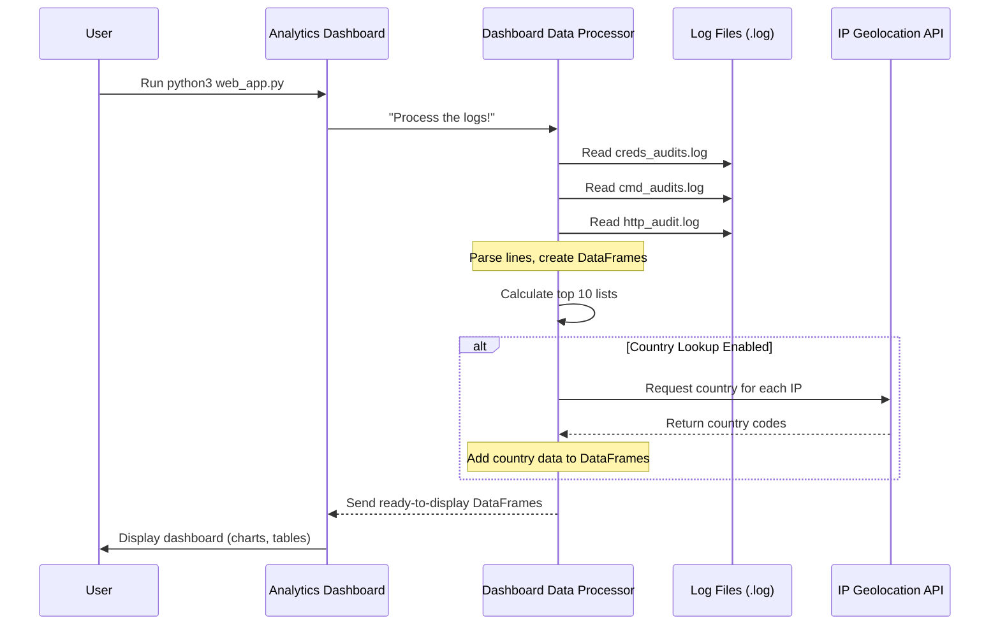

# Chapter 5: Dashboard Data Processor

Welcome back, digital detective! In [Chapter 4: Data Logging System](04_data_logging_system_.md), we learned how HoneyPy meticulously records every interaction an attacker has with your honeypots. You now have files like `creds_audits.log`, `cmd_audits.log`, and `http_audit.log` filled with raw data – IP addresses, usernames, passwords, and commands.

Imagine you have a giant stack of detective notes. They're all important, but trying to read through every single page to find patterns would take forever! You need a smart assistant to organize and summarize everything.

That's precisely what the **Dashboard Data Processor** does for HoneyPy! It's like having a super-skilled data analyst working behind the scenes, taking those raw, messy log files and transforming them into organized, easy-to-understand insights.

### What's the Big Idea? Your Data Analyst in a Box!

The Dashboard Data Processor is the component that makes sense of all the captured log data. It sifts through everything, counts how many times certain IPs or commands appear, and can even figure out *where* those attackers are in the world.

**Its main purpose is to:**

1.  **Clean Up Data**: Read through the text-based log files and break them into structured pieces.
2.  **Summarize Information**: Count common items to generate "top 10" lists (like the most frequent IP addresses or usernames).
3.  **Add Context (Optional)**: Look up the geographical location (country) of attacking IP addresses using an external service.
4.  **Prepare for Display**: Organize all this processed data into a format that's easy for the [Analytics Dashboard](06_analytics_dashboard_.md) to show visually.

Think of it as the kitchen chef who takes raw ingredients (log files), chops and prepares them (parses and cleans), cooks them into delicious dishes (summarizes and enriches), and plates them beautifully (structures into data tables) for you to enjoy.

### How Do You Use It? It Works Behind the Scenes!

You don't directly "use" the Dashboard Data Processor with a specific command. Instead, it springs to life automatically whenever you run HoneyPy's **Analytics Dashboard**.

When you want to see a visual summary of your honeypot's activity, you run the `web_app.py` file:

```bash
python3 web_app.py
```

As soon as you run this command, the `web_app.py` program tells the Dashboard Data Processor to get to work! It goes through all your log files, processes them, and prepares the data. This processed data is then used to create the charts and tables you see in the dashboard.

**Example Input**: Your `log_files` directory containing:
*   `creds_audits.log`
*   `cmd_audits.log`
*   `http_audit.log`

**Example Conceptual Output**: The Data Processor would create internal data tables (called **Pandas DataFrames**) that look something like this:

| IP Address | Username   | Password   |
| :--------- | :--------- | :--------- |
| 1.2.3.4    | root       | password   |
| 5.6.7.8    | admin      | 123456     |
| 1.2.3.4    | user       | secret     |

And another for top commands:

| Command           | Count |
| :---------------- | :---- |
| `ls`              | 15    |
| `pwd`             | 10    |
| `cat config.txt`  | 7     |

These tables are then sent to the dashboard for visualization.

### Under the Hood: The Data Processing Pipeline

So, what exactly happens when you run `python3 web_app.py` and the Dashboard Data Processor gets activated?

#### A Step-by-Step Walkthrough

Imagine a clear assembly line:

1.  **Dashboard Starts**: You run `python3 web_app.py`, which is the main program for the [Analytics Dashboard](06_analytics_dashboard_.md).
2.  **Processor Activated**: The dashboard immediately calls upon the **Dashboard Data Processor** (which is mainly the `dashboard_data_parser.py` file).
3.  **Reading Raw Logs**: The processor opens each of your log files (`creds_audits.log`, `cmd_audits.log`, `http_audit.log`).
4.  **Parsing Each Line**: For every line in each log file, the processor carefully extracts the important bits – like the IP address, username, password, or command. It understands the specific format of each log file.
5.  **Creating Data Tables (DataFrames)**: As it extracts information, it organizes it into structured tables. HoneyPy uses a powerful Python library called **Pandas** to create these tables, known as "DataFrames."
6.  **Calculating Summaries**: Now that the data is in DataFrames, the processor can easily count things. It generates "top 10" lists for IP addresses, usernames, passwords, and commands.
7.  **Looking Up Countries (Optional)**: If you've enabled it (by setting `COUNTRY=True` in `public.env`), the processor takes all the unique IP addresses and sends them to an external online service (CleanTalk API). This service tells HoneyPy the country associated with each IP.
8.  **Ready for Dashboard**: All these clean, summarized, and enriched DataFrames are then passed back to the [Analytics Dashboard](06_analytics_dashboard_.md), which takes over to display them as charts and tables.

Here's a simplified flow diagram:



#### A Peek at the Code

Let's look at simplified pieces from the `dashboard_data_parser.py` file to see how it performs these steps.

First, parsing log files:

```python
# Simplified from dashboard_data_parser.py
import pandas as pd
import re # For finding patterns in text

# --- Parsing Credential Audits Log ---
def parse_creds_audits_log(log_file_path):
    data = []
    try:
        with open(log_file_path, 'r') as file:
            for line in file:
                parts = line.strip().split(', ') # Split line by ', '
                if len(parts) >= 3: # Check if we got at least 3 parts
                    ip_address = parts[0]
                    username = parts[1]
                    password = parts[2]
                    data.append([ip_address, username, password])
    except FileNotFoundError:
        # If the file doesn't exist, return an empty table
        return pd.DataFrame([], columns=["ip_address", "username", "password"])

    # Turn the collected data into a Pandas DataFrame (our structured table)
    df = pd.DataFrame(data, columns=["ip_address", "username", "password"])
    return df

# --- Parsing Command Audits Log ---
def parse_cmd_audits_log(log_file_path):
    data = []
    try:
        with open(log_file_path, 'r') as file:
            # This pattern looks for "Command b'something'executed by IP_ADDRESS"
            pattern = re.compile(r"Command b'([^']*)'executed by (\d+\.\d+\.\d+\.\d+)")
            for line in file:
                match = pattern.search(line) # Try to find the pattern in the line
                if match:
                    command, ip = match.groups() # Get the command and IP
                    data.append({'IP Address': ip, 'Command': command})
    except FileNotFoundError:
        return pd.DataFrame([], columns=['IP Address', 'Command'])

    df = pd.DataFrame(data, columns=['IP Address', 'Command'])
    return df
```
In these snippets:
*   `parse_creds_audits_log` opens `creds_audits.log`, reads each line, and uses `split(', ')` to break it into IP, username, and password.
*   `parse_cmd_audits_log` opens `cmd_audits.log`, and uses a `re.compile` (regular expression) to smartly pull out the command and the IP address from the line, even if there's other text.
*   Both functions then take the extracted information and use `pd.DataFrame(...)` to create a Pandas DataFrame (a structured table).

Next, once data is in DataFrames, generating "top 10" lists is very easy with Pandas:

```python
# Simplified from dashboard_data_parser.py
# ... (imports) ...

def top_10_calculator(dataframe, column_name):
    # Check if the DataFrame is empty or the column doesn't exist
    if dataframe is None or dataframe.empty or column_name not in dataframe.columns:
        return pd.DataFrame([], columns=[column_name, "count"])

    # Count how many times each unique value appears in the specified column
    # Then reset the index to turn the counts into a new column, and get the top 10
    top_10_df = dataframe[column_name].value_counts().reset_index().head(10)
    # Rename the columns for clarity
    top_10_df.columns = [column_name, "count"]
    return top_10_df
```
This `top_10_calculator` function can be used for any column (like "ip_address", "username", "command") to quickly find the most frequent items. `value_counts()` is a powerful Pandas function that does all the counting for us!

Finally, the optional country code lookup:

```python
# Simplified from dashboard_data_parser.py
import requests # For making requests to websites (APIs)
# ... (other imports) ...

def get_country_code(ip_address):
    # This URL is for an external service that tells us the country for an IP
    url = f"https://api.cleantalk.org/?method_name=ip_info&ip={ip_address}"
    try:
        response = requests.get(url) # Ask the external service
        api_data = response.json() # Get the answer back (usually in JSON format)

        if response.status_code == 200: # If the request was successful
            country_info = api_data.get('data', {}).get(ip_address, {})
            return country_info.get('country_code') # Get the two-letter country code
        elif response.status_code == 429:
            print(f"[!] CleanTalk IP->Geolocation Rate Limited Exceeded.")
            return None # Indicate failure due to rate limit
        else:
            print(f"[!] Error: Could not get country for IP {ip_address}")
            return None
    except requests.RequestException as e:
        print(f"[!] Request failed for IP {ip_address}: {e}")
        return None
```
This `get_country_code` function contacts an external online service (the CleanTalk API) over the internet to get the geographical location of an IP address. It also includes important checks for `rate limiting`, which means the service might temporarily block requests if too many are made too quickly. This is why the `public.env` file has a `COUNTRY=True/False` setting – turning it off prevents these API calls, which can slow down the dashboard or hit limits.

The Dashboard Data Processor is essentially a collection of these intelligent parsing and processing functions, all working together to turn raw log data into meaningful insights for your dashboard.

### Conclusion

You've just uncovered the diligent "data analyst" of HoneyPy: the **Dashboard Data Processor**. This crucial component takes all the raw, unstructured information from your log files, meticulously parses it, summarizes it into useful "top 10" lists, and can even enrich it with geographical data. All this hard work prepares the data in easy-to-use Pandas DataFrames, making it perfectly ready for the [Analytics Dashboard](06_analytics_dashboard_.md) to display stunning visualizations.

Now that you understand how the data is prepared, let's move on to the exciting part: seeing how all this processed information is displayed in an appealing and informative way!

[Next Chapter: Analytics Dashboard](06_analytics_dashboard_.md)

---