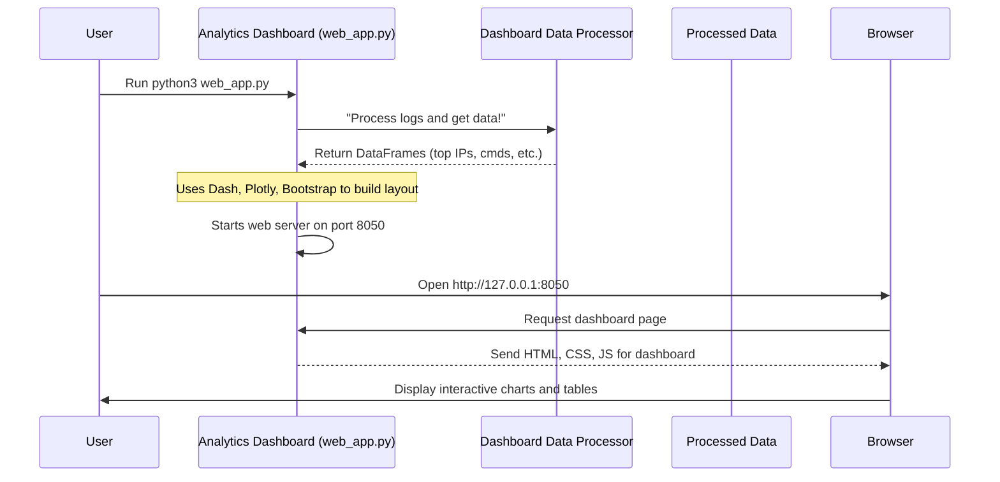

# Chapter 6: Analytics Dashboard

Welcome to the grand finale of your HoneyPy journey! In [Chapter 5: Dashboard Data Processor](05_dashboard_data_processor_.md), you learned how HoneyPy's intelligent "data analyst" takes raw log files and transforms them into neat, organized insights. But what good is all that processed data if you can't see it clearly?

Imagine you're a detective, and your assistant has meticulously organized all your case notes into summaries and timelines. Now, you need a "control room" with a big screen to display all that information visually, so you can quickly spot patterns, trends, and crucial details without sifting through mountains of paper.

That's exactly what the **Analytics Dashboard** is for HoneyPy! It's your personal "control panel" – a user-friendly web application that brings all the gathered intelligence to life through interactive charts and easy-to-read tables.

### What's the Big Idea? Your Security Command Center!

The Analytics Dashboard is the visual heart of your HoneyPy project. It's a web-based application, which means you access it through your internet browser (like Chrome, Firefox, or Edge).

**Its main purpose is to:**

1.  **Visualize Data**: Turn raw numbers and text into easy-to-understand charts (like bar graphs) and tables.
2.  **Summarize Activity**: Show you the "top 10" of important metrics, such as the most active attacker IP addresses, most common usernames/passwords tried, and frequently executed commands.
3.  **Identify Trends**: Help you quickly spot patterns in attacker behavior, like a sudden increase in attempts from a specific country or the frequent use of a certain password.
4.  **Consolidated View**: Give you a single place to see all recorded attacker activity, making it much easier to assess potential threats.

It's built using a powerful Python library called **Dash** (specifically Python Dash), which is fantastic for creating interactive analytical web applications.

### How Do You Use It? Launching Your Control Panel!

Using the Analytics Dashboard is very straightforward. You run a dedicated Python file, and then you open your web browser.

1.  **Ensure Honeypots Have Run**: First, make sure you've run your SSH and/or HTTP honeypots (from [Chapter 2: SSH Honeypot Module](02_ssh_honeypot_module_.md) and [Chapter 3: HTTP Honeypot Module](03_http_honeypot_module_.md)) and that they've collected some data. The dashboard needs logs to display!
2.  **Run the Dashboard Script**: Open a terminal and navigate to your HoneyPy project folder. Then, run the `web_app.py` file:

    ```bash
    python3 web_app.py
    ```

    You'll see some messages about the web server starting up, typically ending with something like:

    ```
     * Running on http://0.0.0.0:8050/ (Press CTRL+C to quit)
    ```

3.  **Open in Browser**: Now, open your favorite web browser and type the address into the address bar:

    `http://127.0.0.1:8050`

    *(If you're accessing it from another computer on your network, replace `127.0.0.1` with the actual IP address of the machine running HoneyPy).*

    Voila! You will see the Analytics Dashboard displaying charts and tables based on the data collected by your honeypots.

**Important Note on Refreshing**: The dashboard **does not dynamically update in real-time**. This means if new attacks happen while the dashboard is open, you won't see them appear instantly. To see the latest data, you need to stop the `web_app.py` script (by pressing `Ctrl+C` in the terminal) and run it again. Each time it starts, it re-processes all your log files to build the freshest view.

#### Country Code Lookup (Optional)

Remember the optional country code lookup we discussed in [Chapter 5: Dashboard Data Processor](05_dashboard_data_processor_.md)? The dashboard includes a panel for this.

*   By default, this feature is often turned `False` in your `public.env` file (located in the main HoneyPy directory) because looking up many IPs can take time or hit API limits.
*   If you want to see the "Top 10 Countries" chart, you need to edit `public.env` and change `COUNTRY=False` to `COUNTRY=True`. Then, restart `web_app.py`.

### Under the Hood: How the Dashboard Shows the Data

So, what magic happens when you run `web_app.py` to create this interactive dashboard?

#### A Step-by-Step Walkthrough

Let's trace the journey from raw logs to beautiful charts:

1.  **You Start the Dashboard**: You run `python3 web_app.py`.
2.  **Data Processing Kicks In**: The `web_app.py` script immediately calls upon the [Dashboard Data Processor](05_dashboard_data_processor_.md). This processor reads all your `creds_audits.log`, `cmd_audits.log`, and `http_audit.log` files, parses them, cleans them, calculates "top 10" lists, and (if enabled) looks up country codes.
3.  **DataFrames are Prepared**: The processor returns all this nicely organized data in **Pandas DataFrames** (structured tables). For example, it provides DataFrames for "top IP addresses," "top usernames," "top commands," and a DataFrame containing all raw login attempts.
4.  **Dash Application Setup**: The `web_app.py` script then uses the Python Dash library to build the web application itself. It tells Dash: "Here's the data, now create a bar chart for top IPs using this column, and another for top commands using that column."
5.  **Charts and Tables Created**: Dash, in turn, uses another library called **Plotly Express** to actually draw the interactive charts and uses **Dash Bootstrap Components** for styling and displaying the raw data in neat tables.
6.  **Web Server Runs**: Finally, the Dash application starts a small web server on port `8050` (by default), making the dashboard accessible through your browser.
7.  **Browser Displays Dashboard**: When you open your browser to `http://127.0.0.1:8050`, your browser requests the dashboard content from this web server, and the server sends back the HTML, CSS, and JavaScript needed to display your interactive charts and tables.

Here's a simplified flow diagram:



#### A Peek at the Code

Let's look at some super simplified pieces from `web_app.py` to see how it ties everything together.

First, the script imports the necessary libraries and the processed data from the `dashboard_data_parser.py` file:

```python
# Simplified from web_app.py

from dash import Dash, html, dcc
import dash_bootstrap_components as dbc
import plotly.express as px

# We import the functions that process the log files
from dashboard_data_parser import parse_creds_audits_log, top_10_calculator, parse_cmd_audits_log

# The data processor gets the data ready for us
creds_audits_log_df = parse_creds_audits_log('path/to/creds_audits.log')
cmd_audits_log_df = parse_cmd_audits_log('path/to/cmd_audits.log')

# Calculate the top 10 lists using the processed data
top_ip_address = top_10_calculator(creds_audits_log_df, "ip_address")
top_usernames = top_10_calculator(creds_audits_log_df, "username")
top_cmds = top_10_calculator(cmd_audits_log_df, "Command")

# Initialize the Dash application (our web app)
app = Dash(__name__, external_stylesheets=[dbc.themes.CYBORG]) # Using a dark theme
```
In this snippet:
*   `Dash` is imported to create the web application.
*   `dbc` (Dash Bootstrap Components) is used for styling and layout (like dark themes).
*   `px` (Plotly Express) is used for easily making charts.
*   It calls functions from `dashboard_data_parser` (as described in Chapter 5) to get the DataFrames like `top_ip_address` and `top_cmds` ready.
*   `app = Dash(...)` creates the core of our web application.

Next, the `app.layout` part defines what the dashboard actually looks like – where the charts and tables are placed:

```python
# Simplified from web_app.py (inside app.layout)

app.layout = dbc.Container([
    html.Div([
        html.H1("HoneyPy Analytics Dashboard", style={'textAlign': 'center'}),
        html.P("Overview of collected honeypot intelligence", style={'textAlign': 'center'})
    ]),

    # Row 1: Top 10 IP Addresses Chart
    dbc.Row([
        dbc.Col(dcc.Graph(figure=px.bar(top_ip_address, x="ip_address", y='count')), width=4),
        dbc.Col(dcc.Graph(figure=px.bar(top_usernames, x='username', y='count')), width=4),
        # ... more charts ...
    ], align='center', class_name='mb-4'),

    # Row 2: Top 10 Commands Chart
    dbc.Row([
        dbc.Col(dcc.Graph(figure=px.bar(top_cmds, x='Command', y='count')), width=4),
        # ... country lookup chart if enabled ...
    ], align='center', class_name='mb-4'),

    # Raw Data Table
    html.H3("Raw Credential Attempts", style={'textAlign': 'center'}),
    dash_table.DataTable(
        data=creds_audits_log_df.to_dict('records'), # Convert DataFrame to dictionary for table
        columns=[{"name": "IP Address", 'id': 'ip_address'},
                 {"name": "Username", 'id': 'username'},
                 {"name": "Password", 'id': 'password'}],
        page_size=10 # Show 10 rows per page
    )
])
```
In this layout code:
*   `dbc.Container`, `dbc.Row`, and `dbc.Col` are used to arrange the elements neatly on the page, like rows and columns in a grid.
*   `html.H1`, `html.P`, `html.Div` are standard HTML tags to add titles and text.
*   `dcc.Graph` is a Dash component that displays a chart. We tell it to create a bar graph (`px.bar`) using our `top_ip_address` DataFrame, showing `ip_address` on the X-axis and `count` on the Y-axis.
*   `dash_table.DataTable` is a Dash component that displays data in an interactive table. It takes our `creds_audits_log_df` (the raw parsed data) and displays it.

Finally, the script tells the Dash app to run:

```python
# Simplified from web_app.py

if __name__ == '__main__':
    app.run(debug=True, host="0.0.0.0")
```
This standard Python code ensures that when you run `python3 web_app.py`, the Dash application starts its web server on all available network interfaces (`0.0.0.0`) on port `8050`, making it accessible to you through your browser. `debug=True` is useful during development, as it provides helpful error messages in the browser.

### Conclusion

You've reached the end of your HoneyPy adventure by understanding the **Analytics Dashboard**! This web application serves as your intuitive "control panel," transforming the raw, captured intelligence from your honeypots into meaningful, visual insights. By using Python Dash and Plotly Express, it effectively displays critical information like top attacker IPs, usernames, passwords, and commands, helping you quickly identify trends and potential threats. While it requires a restart to refresh with new data, it provides a clear, consolidated overview that is invaluable for monitoring your digital traps.

---